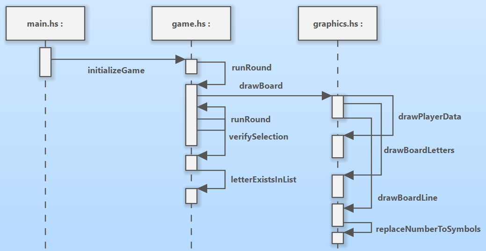
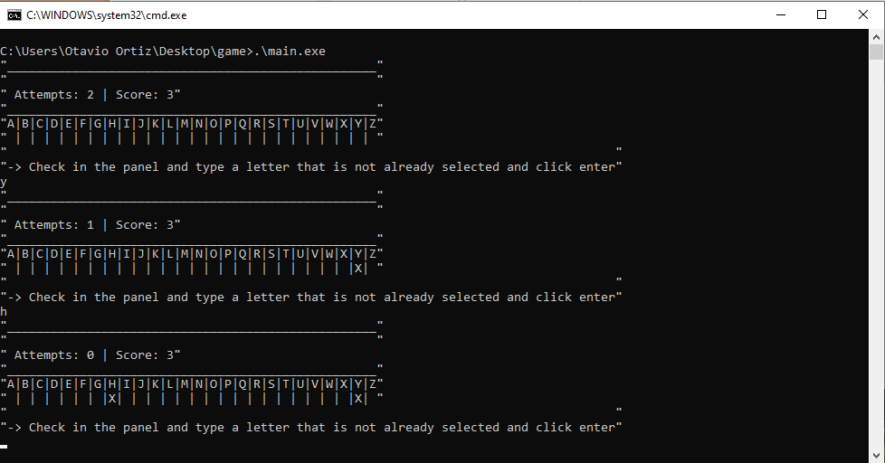

# Haskell Guess Game

Small guessing game test developed in haskell while I studied the language.

To run it, install haskell and type "runhaskell main.hs" in the src folder

Executable: https://otavioortiz.itch.io/haskell-guess-game

